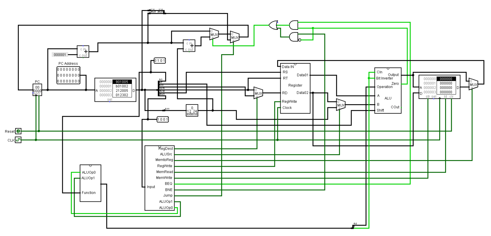

# 24 bit MIPS Architecture
A 24-bit single cycle CPU architecure

This project implements a 24 bit single cycle CPU which can perform the following instructions:

•	R-type\
•	I-type\
•	J-type

**Datapath**

